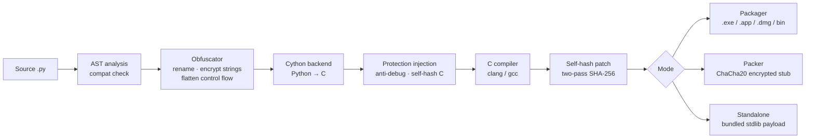

# PyForge

Python source-to-native compiler: AST obfuscation, Cython compilation, and runtime anti-tampering.

---

## The problem

`.pyc` files decompile cleanly. Existing protectors like PyArmor work at the bytecode level, and the reversing community has had working bypasses for all of them for years. PyForge compiles to native machine code via Cython, obfuscates at the AST level before that, and bakes anti-tamper checks directly into the binary.

---

## What it does

- **AST obfuscation** — identifier renaming, per-string HMAC-SHA256/XOR encryption with per-build key rotation, literal rewriting, control flow flattening
- **Cython compilation** — source transpiled to C and compiled to a native binary; no `.py` or `.pyc` in the output
- **Anti-debug** — ptrace (Linux), `sysctl` kern.proc (macOS), `IsDebuggerPresent` / `CheckRemoteDebuggerPresent` (Windows), timing checks, env inspection
- **Self-integrity** — two-pass SHA-256: build with zeroed hash field, compute hash, patch in place; binary exits on any modification
- **Encrypted packer** — ChaCha20-Poly1305 stub; payload runs from anonymous `memfd` on Linux (never touches disk), unlinked tempfile before `execv` on macOS
- **Dependency bundling** — third-party packages embedded as a C byte array, loaded at runtime via zipimport
- **Standalone mode** — stdlib + native extensions appended as a compressed payload; no Python required on the target machine
- **Licensing** — optional HTTP license check compiled into the binary; configurable endpoint, product ID, and key env var
- **Cross-platform packaging** — `.exe` (Windows), `.app` / `.dmg` (macOS), AppImage / binary (Linux), auto-detected
- **Compatibility analysis** — AST pre-scan detects `exec()`, `globals()`, dynamic attributes, async code; disables passes that would break behavior
- **Function-level VM** — sensitive functions lifted into a register-based bytecode VM with a custom interpreter embedded in the binary

---

## Pipeline



---

## Tech stack

- **Python 3.9+** — pipeline orchestration, AST transforms, obfuscation passes
- **Cython** — Python-to-C transpilation
- **clang / gcc** — C compilation and linking
- **zlib** — payload compression (stdlib, no added deps)
- **ChaCha20-Poly1305** — pure C and pure Python implementation, no OpenSSL
- **codesign** — ad-hoc signing on macOS post-compilation
- **create-dmg / AppImageTool** — platform packaging

---

## CLI

```
pyforge compile app.py                   # auto-detect format (exe/dmg/bin)
pyforge compile app.py -f dmg            # force macOS DMG
pyforge compile app.py --pack            # encrypted packer stub
pyforge compile app.py --standalone      # bundle stdlib, no Python required
pyforge compile app.py --no-obfuscate    # skip obfuscation, compile only
pyforge protect app.py                   # obfuscate to app.protected.py, no compile
pyforge protect-binary program.exe       # wrap any binary in encrypted stub
```

---

## Before / after (obfuscation)

**Input:**
```python
def calculate_discount(price, customer_tier):
    if customer_tier == "premium":
        return price * 0.8
    return price
```

**After obfuscation pass:**
```python
def _ctx_a3f9b812(node_c471, _ref_0da4e291):
    _cfg_k = b'\x9f\x3a...'
    if _ref_0da4e291 == _cfg(b'\x7c\x21...', _cfg_k):
        return node_c471 * ((0x4 << 0x3) + -((0x1 * 0x4) + 0x18) + 0x64) / 0x64
    return node_c471
```

String literals encrypted with per-build keys. Variable names randomized but look plausible. Integer constants rewritten as computed expressions. The compiled output is native machine code — none of this is recoverable from the binary.

---

## Status

Active development. Source is private. Available for review during technical interviews — contact below.

Full pipeline done: obfuscation, Cython compilation, anti-debug (3 platforms), self-hash integrity, ChaCha20 packer with memfd on Linux, dependency bundling, standalone mode, licensing, cross-platform packaging, control flow flattening, and function-level VM protection.
