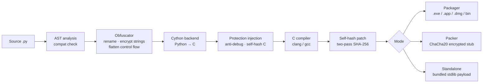

# PyForge

Python source-to-native compiler: AST obfuscation, Cython compilation, and runtime anti-tampering.

---

## The problem

Python code is trivially reversible. `.pyc` files decompile cleanly with tools like `uncompyle6`, and existing protectors like PyArmor operate at the bytecode level — leaving a clear attack surface. PyForge takes a layered approach: obfuscate at the source level, compile to native machine code via Cython, and embed runtime protections that make patching and inspection significantly harder.

---

## What it does

- **AST obfuscation** — identifier renaming, per-string HMAC-SHA256 + XOR encryption with per-build key rotation, integer/bytes literal rewriting, and control flow flattening (while-loop state machine replacement)
- **Cython compilation** — Python source is transpiled to C and compiled to a native binary; no `.py` or `.pyc` files in the output
- **Runtime anti-debug** — ptrace detection (Linux), `sysctl` kern.proc checks (macOS), `IsDebuggerPresent` / `CheckRemoteDebuggerPresent` (Windows), timing-based detection, and environment variable inspection
- **SHA-256 self-integrity check** — two-pass build: binary compiled with zeroed hash field, hash computed, patched back in place; any modification at rest causes exit at startup
- **Encrypted packer** — ChaCha20-Poly1305 encrypted stub; on Linux the payload runs from an anonymous `memfd` and never touches disk, on macOS the temp file is unlinked before `execv`
- **Dependency bundling** — third-party packages zipped and embedded as a C byte array, extracted to `sys.path` at runtime via Python's zipimport
- **Standalone mode** — stdlib + native extensions appended as a compressed payload; extracted to a temp dir at startup, no Python installation required on the target machine
- **Licensing** — optional HTTP license check injected into the binary at compile time, configurable endpoint + product ID + key env var
- **Cross-platform packaging** — `.exe` (Windows), `.app` / `.dmg` (macOS), AppImage / binary (Linux), auto-detected by platform
- **Compatibility analysis** — AST pre-scan detects `exec()`, `globals()`, dynamic attribute access, and async code; automatically disables passes that would break runtime behavior

---

## Pipeline



---

## Tech stack

- **Python 3.9+** — pipeline orchestration, AST transforms, obfuscation passes
- **Cython** — Python-to-C transpilation
- **clang / gcc** — C compilation and linking
- **zlib** — payload compression (stdlib, no added deps)
- **ChaCha20-Poly1305** — encryption, implemented in pure C and pure Python (no OpenSSL dependency)
- **codesign** — ad-hoc signing on macOS post-compilation
- **create-dmg / AppImageTool** — platform packaging

---

## CLI

```
pyforge compile app.py                   # auto-detect format (exe/dmg/bin)
pyforge compile app.py -f dmg            # force macOS DMG
pyforge compile app.py --pack            # encrypted packer stub
pyforge compile app.py --standalone      # bundle stdlib, no Python required
pyforge compile app.py --no-obfuscate    # skip obfuscation, compile only
pyforge protect app.py                   # obfuscate to app.protected.py, no compile
pyforge protect-binary program.exe       # wrap any binary in encrypted stub
```

---

## Before / after (obfuscation)

**Input:**
```python
def calculate_discount(price, customer_tier):
    if customer_tier == "premium":
        return price * 0.8
    return price
```

**After obfuscation pass:**
```python
def _ctx_a3f9b812(node_c471, _ref_0da4e291):
    _cfg_k = b'\x9f\x3a...'
    if _ref_0da4e291 == _cfg(b'\x7c\x21...', _cfg_k):
        return node_c471 * ((0x4 << 0x3) + -((0x1 * 0x4) + 0x18) + 0x64) / 0x64
    return node_c471
```

String literals encrypted with per-build keys. Variable names randomized but visually plausible. Integer constants rewritten into computed expressions. The compiled output is native machine code — none of this is in any recoverable form in the binary.

---

## Status

Active development. Source is private. Available for review during technical interviews — contact below.

Full pipeline (obfuscate → Cython → native), anti-debug (3 platforms), self-hash integrity, packer with memfd execution (Linux), dependency bundling, standalone mode, licensing, cross-platform packaging, control flow flattening, and VM-based protection for individual sensitive functions — hand-picked hotspots lifted into a register-based bytecode VM with a custom interpreter.

---

## About

Started PyForge to understand how commercial Python protectors actually work at a low level — most of the existing tooling is opaque and the reversing community has published clean bypasses for all of them. The interesting parts turned out to be the C integration (getting Cython's output to play nicely with injected protection code), the two-pass self-hash build (you can't hash a binary that contains its own hash), and the memfd packer on Linux which keeps the payload out of the filesystem entirely.

Next milestone is the function-level VM: isolate a function's bytecode, compile it to a custom IR, and execute it in a C interpreter embedded in the binary. The goal is that even with a working debugger attached, extracting the logic of a protected function requires implementing a disassembler for a custom ISA that changes per build.
